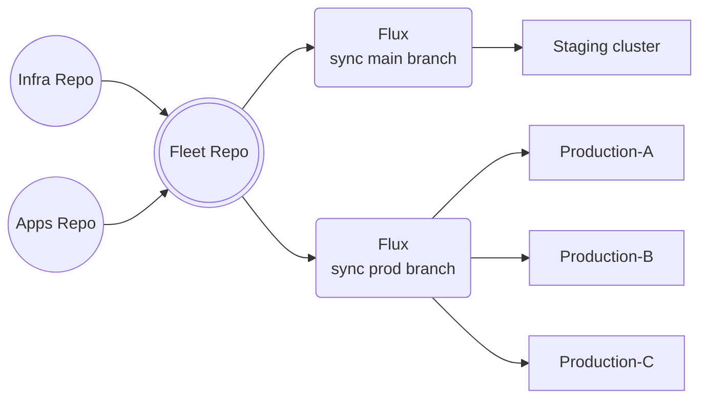

# d1-fleet

> [!NOTE]
> This repository is part of the reference architecture for the
> [ControlPlane Enterprise for Flux CD](https://github.com/controlplaneio-fluxcd/distribution).
>
> The `d1` reference architecture comprised of
> [d1-fleet](https://github.com/controlplaneio-fluxcd/d1-fleet),
> [d1-infra](https://github.com/controlplaneio-fluxcd/d1-infra) and
> [d1-apps](https://github.com/controlplaneio-fluxcd/d1-apps) 
> is a set of best practices and production-ready examples for using Flux
> to manage the continuous delivery of Kubernetes infrastructure and
> applications on multi-cluster multi-tenant environments.

## Scope and Access Control

This repository is managed by the platform team who are responsible for
the Kubernetes infrastructure and have direct access to the fleet of clusters.

The platform team that manages this repository must have **admin** rights to the `d1-fleet` repository
and **cluster admin** rights to all clusters in the fleet to be able to perform the following tasks:

- Bootstrap Flux with multi-tenancy restrictions on fleet clusters.
- Configure the delivery of platform components (defined in [d1-infra repository](https://github.com/controlplaneio-fluxcd/d1-infra)).
- Configure the delivery of applications (defined in [d1-apps repository](https://github.com/controlplaneio-fluxcd/d1-apps)).



## Create a GitHub Account for Flux

Create a new GitHub account for the Flux bot. This account will be used by
the Flux controllers running on clusters to authenticate with GitHub.

Create a GitHub team under your organisation for the bot account and give it the following permissions:

- Read-only access to the `d1-fleet` repository (required for cluster bootstrap)
- Read and write access to the `d1-infra` and `d1-apps` repositories (required for cluster reconciliation and image automation)

### Flux GitHub PAT for platform components

Create a GitHub fine-grained personal access token for the bot account with
the following permissions for the `d1-fleet` repository:

- `Administration` -> `Access: Read-only`
- `Commit statuses` -> `Access: Read and write`
- `Contents` -> `Access: Read-only`
- `Metadata` -> `Access: Read-only`

This token will be stored in all clusters to authenticate with GitHub to pull the fleet
desired state from the `d1-fleet` repository.

Create a second GitHub fine-grained personal access token for the bot account with
the following permissions for the `d1-infra` and `d1-apps` repositories:

- `Administration` -> `Access: Read-only`
- `Commit statuses` -> `Access: Read and write`
- `Contents` -> `Access: Read and write`
- `Metadata` -> `Access: Read-only`

This token will be stored in all clusters to authenticate with GitHub to pull the fleet
desired state from the `d1-infra` repository. The token is also used to automate the
Helm chart updates in the `d1-infra` and `d1-apps` repositories, where the bot account
has push access to the main branch.

## Bootstrap Procedure

The bootstrap procedure is a one-time operation that sets up Flux Operator and the Flux controllers
on the cluster, and configures the delivery of platform components and applications.

After bootstrap, Flux will monitor the repository for changes and will reconcile Flux Operator
from the Kubernetes manifest at `./clusters/<cluster_name>/flux-system/flux-operator.yaml` and
the FluxInstance resource from the Kubernetes manifest at
`./clusters/<cluster_name>/flux-system/flux-instances.yaml`. Flux Operator, in turn, will
reconcile Flux from the FluxInstance resource applied in the cluster by Flux. This results in
Flux reconciling Flux Operator, and Flux Operator reconciling Flux, creating a self-sustaining
reconciliation loop. Changes to Flux configuration and version upgrades are done by modifying
the repository and letting Flux Operator reconcile the changes, there is no need to run the
bootstrap command ever again nor connect to the cluster.

### Bootstrap the staging cluster

Make sure to set the default context in your kubeconfig to your staging cluster, then run the following:

```shell
export GITHUB_TOKEN=<Flux Bot PAT>
export GITHUB_OWNER=<Your GitHub org or user>

# Install the Flux Operator Helm chart
helm install flux-operator oci://ghcr.io/controlplaneio-fluxcd/charts/flux-operator \
  --namespace flux-system \
  --create-namespace

# Create the flux-system Git secret with the Flux bot PAT
flux create secret git flux-system \
  --url=https://github.com/${GITHUB_OWNER}/d1-fleet \
  --username=git \
  --password=$GITHUB_TOKEN

# Apply the FluxInstance custom resource to bootstrap Flux
kubectl apply -f clusters/staging/flux-system/flux-instance.yaml

# Onboard the apps tenant by creating the flux-apps secret with the apps GitHub PAT
flux create secret git flux-apps \
  --namespace=flux-system \
  --label=toolkit.fluxcd.io/tenant=apps \
  --url=https://github.com \
  --username=git \
  --password=$GITHUB_TOKEN
```

From this point on, the Flux controllers will reconcile the cluster state with the desired state. Any changes
to the `clusters/staging` directory in the `d1-fleet` repository will be automatically applied to the cluster.

### Upgrade to the enterprise version

When using the [ControlPlane enterprise](https://control-plane.io/enterprise-for-flux-cd/)
distribution for Flux, you need to create a 
Kubernetes Image Pull Secret for the enterprise registry in the `flux-system` namespace:

```shell
flux create secret oci flux-enterprise-auth \
  --url=ghcr.io \
  --username=flux \
  --password=$FLUX_ENTERPRISE_TOKEN
```

Then you need to update the `.spec.distribution.registry` field of the FluxInstance to the
Flux Enterprise distribution you prefer, such as `ghcr.io/controlplaneio-fluxcd/alpine` or
`ghcr.io/controlplaneio-fluxcd/distroless`, and add the `.spec.distribution.imagePullSecret`
field to reference the image pull secret created above. Example:

```yaml
spec:
  distribution:
    version: 2.7.x
    registry: ghcr.io/controlplaneio-fluxcd/distroless-fips
    artifact: "oci://ghcr.io/controlplaneio-fluxcd/flux-operator-manifests:latest"
    imagePullSecret: flux-enterprise-auth
```

Another option is to copy the images from the ControlPlane registry to your organization's registry
and update the `.spec.distribution.registry` field to point to your registry. You will also need to
specify the distribution variant in the field `.spec.distribution.variant`.

Copying an image from the ControlPlane registry to your organization's registry can be done with the following commands:

```shell
FLUX_CONTROLLERS=(
  "source-controller"
  "kustomize-controller"
  "helm-controller"
  "notification-controller"
  "image-reflector-controller"
  "image-automation-controller"
  "source-watcher"
)

for controller in "${FLUX_CONTROLLERS[@]}"; do
  crane copy --all-tags ghcr.io/controlplaneio-fluxcd/distroless/$controller  <your-registry>/$controller
done
```

Manifest example:

```yaml
spec:
  distribution:
    version: 2.7.x
    registry: <your-registry>
    variant: enterprise-distroless-fips
```

### Rotate the Flux GitHub PAT

It is recommended to use GitHub fine-grained personal access tokens that expire. Before the Flux bot token expires,
you should rotate the token by creating a new one and updating the `flux-system` secret in the `flux-system` namespace:

```shell
flux create secret git flux-system \
  --namespace=flux-system \
  --url=https://github.com \
  --username=git \
  --password=$NEW_GITHUB_TOKEN
```

## Onboarding platform components

The platform team is responsible for onboarding the platform components defined as Flux HelmReleases in the
[d1-infra repository](https://github.com/controlplaneio-fluxcd/d1-infra) and set the dependencies
between the components.

Platform components are cluster add-ons such as CRD and admission controllers,
and are reconciled by Flux as the **cluster admin**.

To onboard a component from the `d1-infra` repository, the platform team must add a
Flux Kustomization to the `tenants/infra/components` directory in the `d1-fleet` repository.

For example, the `d1-fleet` repository contains the following definitions for the `infra` tenant:

```shell
./tenants/infra/components/
├── admission.yaml
└── monitoring.yaml
```

Which configures the reconciliation the `infra` components defined in the `d1-infra` repository:

```shell
./components/
├── admission
│   ├── configs
│   │   ├── base
│   │   ├── production
│   │   └── staging
│   └── controllers
│       ├── base
│       ├── production
│       └── staging
└── monitoring
    ├── configs
    │   ├── base
    │   ├── production
    │   └── staging
    └── controllers
        ├── base
        ├── production
        └── staging
```

### Runtime configuration

In the `clusters/<cluster-name>/runtime-info.yaml` ConfigMaps, the platform team sets which
configuration overlay to use for all components and from which branch to reconcile the changes.

For example, the `staging` cluster is configured to reconcile the `main` branch of the `d1-infra`
and `d1-apps` repositories, and to use the `staging` overlay for all components:

```yaml
apiVersion: v1
kind: ConfigMap
metadata:
  name: flux-runtime-info
  namespace: flux-system
  labels:
    toolkit.fluxcd.io/runtime: "true"
  annotations:
    kustomize.toolkit.fluxcd.io/ssa: "Merge"
data:
  ENVIRONMENT: "staging"
  GIT_BRANCH: "main"
  CLUSTER_NAME: "staging-1"
  CLUSTER_DOMAIN: "preview1.example.com"
```

The `flux-runtime-info` ConfigMap is propagated to all namespaces in a cluster by a Kyverno policy,
and is used by all Flux Kustomizations to perform substitutions when reconciling the components.

The platform team can extend the `flux-runtime-info` ConfigMap with additional fields such as
cluster region, cloud provider ID, etc. 

## Onboarding tenants

The platform team is responsible for onboarding the applications defined as Flux HelmReleases in the
[d1-apps repository](https://github.com/controlplaneio-fluxcd/d1-apps) and restricting the access
to predefined Kubernetes namespaces.

### Flux GitHub PAT for tenant components

Create a GitHub fine-grained personal access token for the Flux bot account with
the following permissions for the `d1-apps` repository:

- `Administration` -> `Access: Read-only`
- `Commit statuses` -> `Access: Read and write`
- `Contents` -> `Access: Read and write`
- `Metadata` -> `Access: Read-only`

After the cluster is bootstrapped, the platform team can onboard tenant applications by creating
a Kubernetes secret in the `flux-system` namespace with the tenant's GitHub PAT:

```shell
export APPS_GITHUB_TOKEN=<Flux bot apps PAT>

flux create secret git flux-apps \
  --namespace=flux-system \
  --label=toolkit.fluxcd.io/tenant=apps \
  --url=https://github.com \
  --username=git \
  --password=$APPS_GITHUB_TOKEN
```

The tenant GitHub PAT secret is propagated from the `flux-system` namespace to all namespaces
where the tenant applications are running, using a Kyverno policy. When rotating the tenant GitHub PAT,
updating the `flux-apps` secret in the `flux-system` namespace will automatically propagate the new token
to all tenant namespaces labeled with `toolkit.fluxcd.io/tenant: apps`.

### Continuous Delivery for tenant applications

For each namespace belonging to a tenant, the platform team must define the Kubernetes
namespace, RBAC, Flux GitRepository and Kustomization custom resources under the
tenant's directory. 

The directory structure under
[tenants/apps](https://github.com/controlplaneio-fluxcd/d1-fleet/tree/main/tenants/apps)
matches the components defined in the
[d1-apps repository](https://github.com/controlplaneio-fluxcd/d1-apps/components).

For example, the `d1-fleet` repository contains the following definitions for the `backend` namespace:

```shell
./tenants/apps/components/backend/
├── kustomization.yaml
├── namespace.yaml
├── rbac.yaml
└── sync.yaml
```

Which configures the reconciliation under a restricted service account for the `backend` components defined in the
[d1-apps repository](https://github.com/controlplaneio-fluxcd/d1-apps/components/backend):

```shell
./components/backend/
├── base
│   ├── bitnamicharts.yaml
│   ├── kustomization.yaml
│   ├── memcached.yaml
│   └── redis.yaml
├── production
│   ├── kustomization.yaml
│   ├── memcached-values.yaml
│   └── redis-values.yaml
└── staging
    ├── kustomization.yaml
    ├── memcached-values.yaml
    └── redis-values.yaml
```

Changes made by the dev team to the `d1-apps` repository in the `main` branch will
be automatically reconciled by the Flux controllers running in the staging cluster.

Changes made by the dev team to the `d1-apps` repository in the `production` branch will
be automatically reconciled by the Flux controllers running in the production cluster fleet.

The dev team can make any changes inside the namespaces assigned by the platform team, but they
cannot change any cluster-wide resources or the namespace itself.

### Helm release automation for tenant applications

The staging cluster runs the Flux image automation controllers which automatically
update the HelmRelease definitions in the `main` branch of the `d1-apps` repository
based on Flux image polices defined by the dev team.

When a new chart version is pushed to the container registry, and if it matches the semver policy,
Flux will update the HelmRelease YAML definitions and will push the changes to the `main` branch.

After the changes are reconciled on staging, the dev team can promote the changes
to the production clusters by merging the `main` branch into the `production` branch of the `d1-apps` repository.

The platform team is responsible for configuring a dedicated Kubernetes namespace for 
the image policies and defining the Flux image update automation custom resources in the `d1-fleet` repository:

```shell
./tenants/apps/update/
├── automation.yaml
├── kustomization.yaml
├── namespace.yaml
├── rbac.yaml
└── sync.yaml
```

The above configuration will reconcile the image polices define in the
[d1-apps repository](https://github.com/controlplaneio-fluxcd/d1-apps/components):

```shell
./update/
├── backend-memcached.yaml
├── backend-redis.yaml
├── frontend-podinfo.yaml
└── kustomization.yaml
```

The dev team has full control over the image policies, and they are responsible for
defining the image update automation rules for their applications.
The platform team is responsible for setting up the infrastructure for running the
Flux image automation controllers and their access to the dev team repository.

## Bootstrap the production clusters

Make sure to set the default context in your kubeconfig to your production cluster, then run the following:

```shell
export GITHUB_TOKEN=<Flux Bot PAT>
export GITHUB_OWNER=<Your GitHub org or user>

# Install the Flux Operator Helm chart
helm install flux-operator oci://ghcr.io/controlplaneio-fluxcd/charts/flux-operator \
  --namespace flux-system \
  --create-namespace

# Create the flux-system Git secret with the Flux bot PAT
flux create secret git flux-system \
  --url=https://github.com/${GITHUB_OWNER}/d1-fleet \
  --username=git \
  --password=$GITHUB_TOKEN

# Apply the FluxInstance custom resource to bootstrap Flux
kubectl apply -f clusters/prod-eu/flux-system/flux-instance.yaml

# Onboard the apps tenant by creating the flux-apps secret with the apps GitHub PAT
flux create secret git flux-apps \
  --namespace=flux-system \
  --label=toolkit.fluxcd.io/tenant=apps \
  --url=https://github.com \
  --username=git \
  --password=$GITHUB_TOKEN
```

From this point on, the Flux controllers will reconcile the cluster state with the desired state. Any changes
to the `clusters/prod-eu` directory in the `d1-fleet` repository in the `main` branch will be automatically
applied to the cluster. The apps and infra components will be reconciled from the `production` branch of the
`d1-infra` and `d1-apps` repositories.

### Monitoring

To monitor the reconciliation process, run the following commands in different terminals:

```shell
watch flux get kustomizations --all-namespaces
watch kubectl get pods --all-namespaces
```

To list all the managed resources by Flux, run:

```shell
flux tree ks flux-system
```

To view the Flux events with the reconciliation status, run:

```shell
flux events -A
```

### Grafana dashboards

To access Grafana, start port forward in a separate shell:

```shell
kubectl -n monitoring port-forward svc/kube-prometheus-stack-grafana  3000:80
```

Navigate to http://localhost:3000 in your browser and login with user `admin` and password `flux`.

Flux dashboards:

- Reconciliation stats: `http://localhost:3000/d/flux-cluster/flux-cluster-stats`
- Controller stats: `http://localhost:3000/d/flux-control-plane/flux-control-plane`
